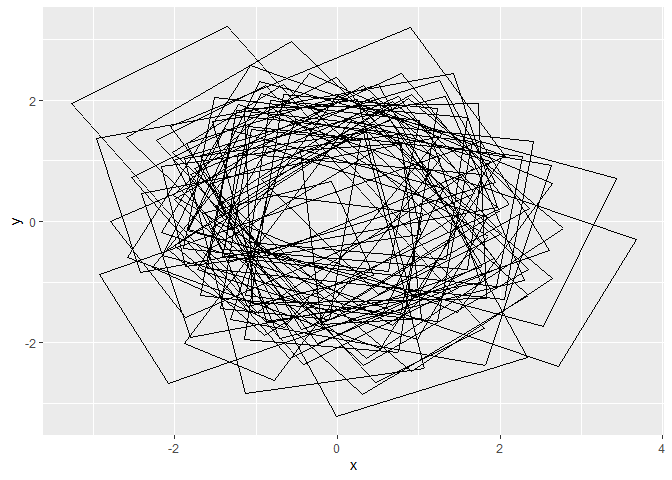
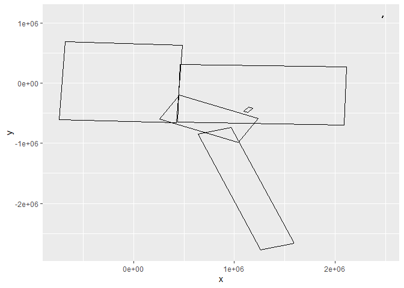

<!-- README.md is generated from README.Rmd. Please edit that file -->

# ggminboundingrect

<!-- badges: start -->

<!-- badges: end -->

The goal of ggminboundingrect is to provide ggplot2 support for minimum
bounding rectangle.

## Installation

You can install ggminboundingrect from
[CRAN](https://github.com/mdsumner/ggminboundingrect) with:

``` r
remotes::install_github("mdsumner/ggminboundingrect")
```

## Example

This is a basic example which shows you how to compute and draw the
minimum bounding rectangle with `geom_mbr()`.

``` r
library(ggminboundingrect)

library(ggplot2)
ggplot(data.frame(x = rnorm(500), y = rnorm(500), group = rep(1:50, each = 10)), aes(x, y, group = group))  + geom_mbr()
```



Some sf examples, by decomposing to data frame (known as ‘fortify’ in
old ggplot2 circles ).

``` r
## bounds on the feature
d <- sfheaders::sf_to_df(silicate::inlandwaters)
ggplot(d,aes(x, y, group = sfg_id)) + geom_mbr()
```



``` r

## bounds on the polygon (it is a polygon so has 'polygon_id' but might not so consider 'sfg_id')
## also note that polygon_id is not unique across features
d <- sfheaders::sf_to_df(silicate::inlandwaters)
ggplot(d,aes(x, y, group = paste(sfg_id, polygon_id))) + geom_mbr()
```


``` r

## bounds on the path (it is a polygon so has 'linestr_id' but might not so consider 'sfg_id' or multipoint_id etc)
## also note linestring_id is not unique
d <- sfheaders::sf_to_df(silicate::inlandwaters)
ggplot(d,aes(x, y, group = paste(polygon_id, linestring_id))) + geom_mbr()
```


Use `stat_mbr()` to avoid the default use of path geom drawing .

``` r
ggplot(d,aes(x, y, group = sfg_id, colour = factor(sfg_id))) + stat_mbr(geom = "point") + coord_equal()
```


## Ackknowledgements

Thanks to Thomas Pedersen for the awesome ggplot2-extending guide
(<https://ggplot2-book.org/spring1.html>).

Thanks to Mike FC for inspiration.

-----

## Code of Conduct

Please note that the ggminboundingrect project is released with a
[Contributor Code of
Conduct](https://contributor-covenant.org/version/2/0/CODE_OF_CONDUCT.html).
By contributing to this project, you agree to abide by its terms.
